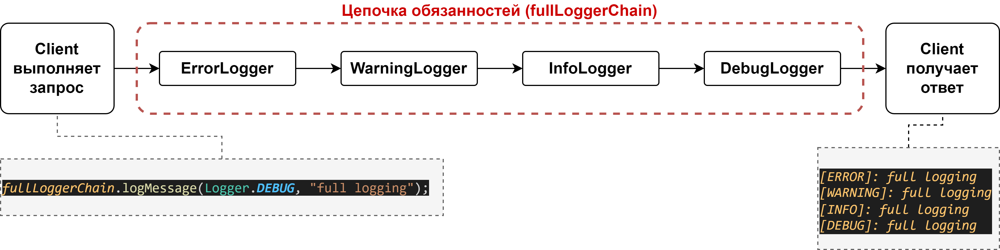
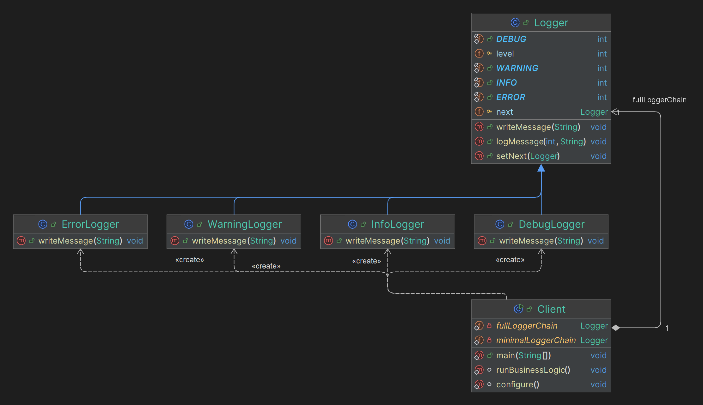

# Chain of Responsibility

## Какие проблемы решает?

1. **Избыточная связь между отправителем и получателем запроса:** Устраняет необходимость прямого обращения отправителя 
запроса к конкретным получателям. Это снижает зависимость между компонентами системы.
2. **Обработка запроса разными способами:** Позволяет нескольким объектам обработать запрос без жесткого связывания их 
с отправителем запроса.
3. **Гибкость в распределении обязанностей:** Легко добавлять, удалять или изменять обработчики без изменения других 
компонентов системы.
4. **Изоляция отправителя и получателя:** Отправитель не знает, какой объект из цепочки обработает запрос.

## Простой пример на абстракциях для понимания (принцип его работы)

Представим, что у нас есть система логирования с четырьмя уровнями:
- **DEBUG:** Сообщения для отладки.
- **INFO:** Информационные сообщения.
- **WARNING:** Предупреждающие сообщения.
- **ERROR:** Сообщения об ошибках.

Мы хотим создать цепочку логгеров, где каждый логгер отвечает за определенный уровень логирования и передает сообщение 
следующему логгеру в цепочке, если не может его обработать.

В результате должна получиться следующая условная структура.

Структура

## Простая uml диаграмма на основании этого кода

Idea uml

## Где применяется на практике?

1. GUI-элементы: Обработка событий (нажатий кнопок, ввод текста и т.д.), когда события обрабатываются сначала ближайшим 
элементом, а затем передаются вышестоящим элементам, если не обработаны.
2. Системы логирования: Разные уровни логирования (информация, предупреждения, ошибки и т.д.), когда сообщения 
передаются через цепочку обработчиков.
3. Системы поддержки клиентов: Обработка запросов, когда запросы клиентов обрабатываются различными уровнями поддержки 
(оператор, специалист, менеджер и т.д.).
4. Промежуточное ПО в веб-приложениях: Обработка HTTP-запросов с использованием цепочки промежуточных 
обработчиков (middleware).

## Шаги реализации

1. **Определить интерфейс обработчика:** Определите общий интерфейс или абстрактный класс с методом для 
обработки запроса.
2. **Создать конкретные обработчики:** Реализуйте конкретные классы обработчиков, которые будут наследовать интерфейс 
обработчика и реализовывать метод обработки. 
3. **Связать обработчиков в цепочку:** Установите последовательность обработчиков, связывая их между собой.
4. **Отправка запроса:** Отправляйте запрос первому обработчику в цепочке, который либо обработает его, либо 
передаст следующему.

## Паттерны, которые реализуются похожим образом

**NOT IMPLEMENTED**