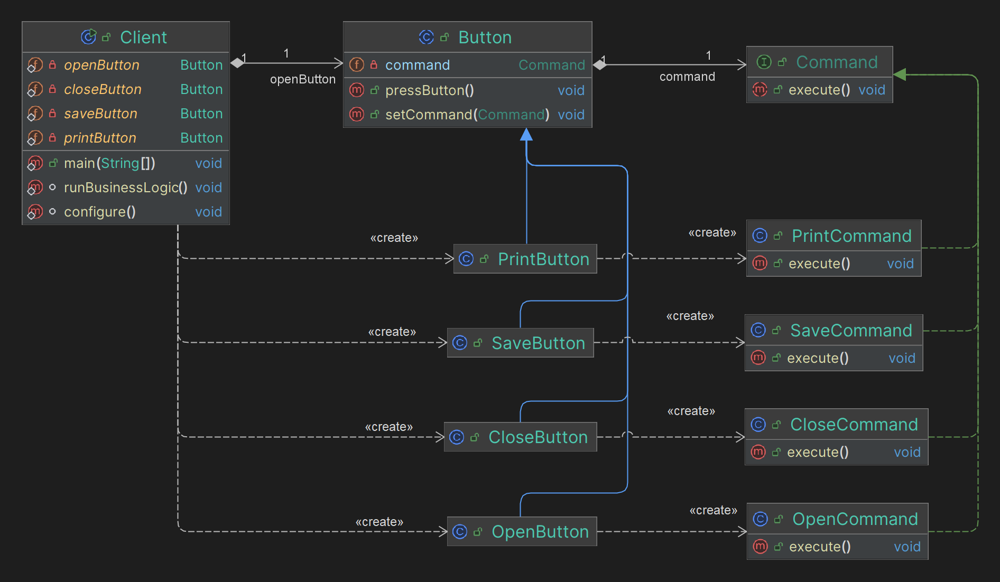

# Decorator

## Какие проблемы решает?

1. **Запросы как объекты:** Инкапсуляция запросов в объекты позволяет сохранять, логировать, отменять и восстанавливать 
их, что сложно сделать с обычными методами.
2. **Упрощение взаимодействия отправителя и получателя:** Разделяет объекты, инициирующие запросы (отправители), от 
объектов, выполняющих запросы (получатели).
3. **Возможность отмены и повторного выполнения:** Легко реализовать механизм отмены и повторного выполнения операций.
4. **Логирование операций:** Возможность логирования запросов и операций для последующего анализа или восстановления 
состояния.

## Простой пример на абстракциях для понимания (принцип его работы)

Пример из [refactoring.guru](https://refactoring.guru/ru/design-patterns/command) про кнопки

## Простая uml диаграмма на основании этого кода

Idea uml

## Где применяется на практике?

1. GUI приложения: Команды, привязанные к кнопкам или меню.
2. Системы отмены/повтора: Поддержка undo/redo операций.
3. Очереди задач: Управление и выполнение задач в очереди.
4. Логирование изменений: Сохранение изменений для анализа или восстановления.

## Шаги реализации

1. **Определить интерфейс Command:** Создать интерфейс с методом execute().
2. **Создать конкретные команды:** Реализовать конкретные команды, которые будут вызывать методы на получателе.
3. **Определить получателя:** Создать класс, который будет выполнять основные операции.
4. **Создать инициатор:** Создать класс, который будет хранить команду/ы и вызывать их метод execute().
5. **Клиентский код:** Создать объекты команд и передать их инициатору для выполнения.

## Паттерны, которые реализуются похожим образом

**NOT IMPLEMENTED**