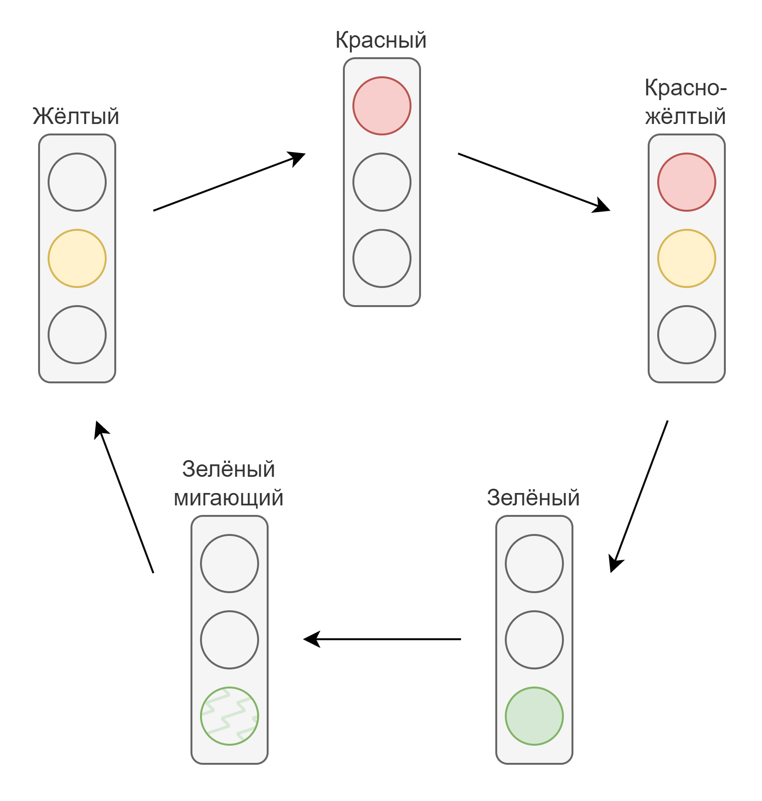
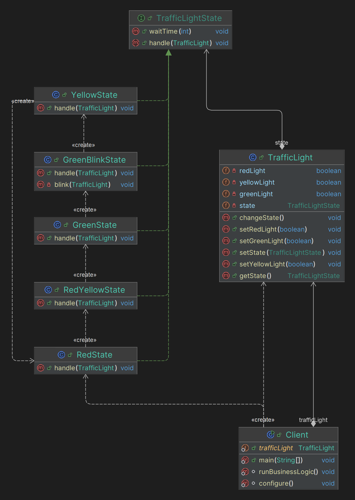

# State

## Какие проблемы решает?

1. **Разрастание условий:** Когда у объекта много различных состояний, логика переключения между ними может оказаться 
запутанной и сложной для понимания и поддержки. Например, использование множества условных операторов 
(if-else или switch) для управления состояниями объекта.
2. **Разделение ответственности:** Разные состояния объекта могут иметь разное поведение. Разделение этих состояний 
на отдельные классы позволяет разделить логику и облегчить поддержку кода.
3. **Динамическое изменение поведения:** Позволяет объекту менять свое поведение в зависимости от текущего состояния, 
что делает код более гибким и расширяемым.

## Простой пример на абстракциях для понимания (принцип его работы)

Представим, что у нас есть светофор. Светофор проходит через состояния:

- **Красный**
- **Красно-желтый**
- **Зеленый**
- **Зеленый мигающий**
- **Желтый**

Каждое из которых имеет свою длительность и поведение. Логика каждого состояния инкапсулирована в отдельном классе, 
что делает код более чистым и понятным. Кроме того, в данном примере состояния знают о друг другей и инициируют 
переходы от одного состояния к другому.

Переходы состояний

## Простая uml диаграмма на основании этого кода

Idea uml

## Где применяется на практике?

1. Автоматы состояний: Приложения, моделирующие конечные автоматы (например, автоматы продажи билетов).
2. Редакторы текстов: Управление режимами (вставка, удаление, выделение).
3. Игровые приложения: Управление состояниями персонажей (бег, прыжок, атака).
4. Программные интерфейсы: Управление состояниями UI компонентов (например, кнопка может быть активной, 
неактивной, нажатой).

## Шаги реализации

1. **Определите интерфейс состояния:** Создайте интерфейс или абстрактный класс, который будет содержать методы, 
реализуемые в различных состояниях объекта.
2. **Создайте конкретные классы состояний:** Реализуйте этот интерфейс или абстрактный класс в классах, которые 
представляют разные состояния объекта.
3. **Создайте класс контекста:** Это класс, который будет содержать текущее состояние и делегировать вызовы методов 
текущему состоянию.
4. **Реализуйте методы перехода между состояниями:** В каждом классе состояния реализуйте логику, которая изменяет 
состояние объекта.

## Паттерны, которые реализуются похожим образом

**NOT IMPLEMENTED**