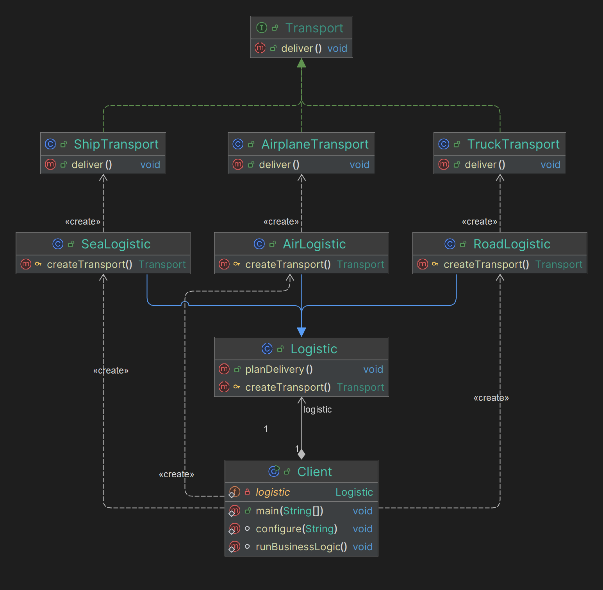

# Factory Method

## Какие проблемы решает?

1. **Создание объектов без привязки к конкретным классам:** Паттерн "Factory Method" позволяет создавать объекты, 
не привязываясь к конкретным классам, что упрощает замену и расширение классов.
2. **Уменьшение зависимости между классами:** Он уменьшает зависимость кода от конкретных классов, улучшая гибкость и 
модульность приложения.
3. **Инкапсуляция логики создания объектов:** Логика создания объектов переносится в отдельные методы, что упрощает 
управление и модификацию процесса создания.

## Простой пример на абстракциях для понимания (принцип его работы)

Пример из [refactoring.guru](https://refactoring.guru/ru/design-patterns/factory-method) про логистику

## Простая uml диаграмма на основании этого кода

Idea uml

## Где применяется на практике

В Spring Framework паттерн "Factory Method" используется для создания бинов через фабричные методы. 
Это позволяет создавать бины, используя методы, которые возвращают экземпляры объектов, а не указывая конкретные 
классы в конфигурации.

## Паттерны, которые реализуются похожим образом

**NOT IMPLEMENTED**