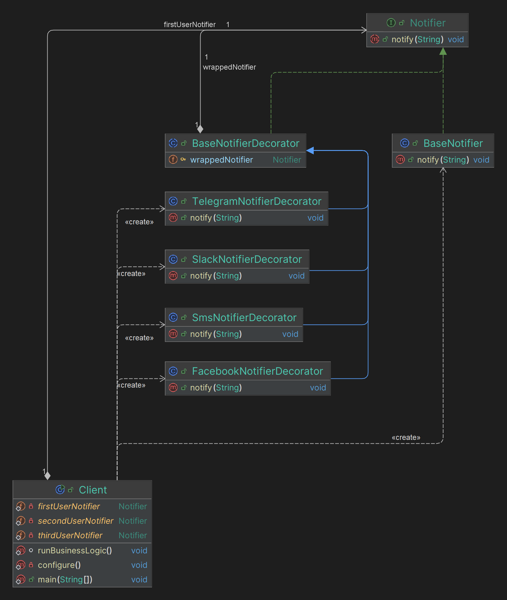

# Decorator

## Какие проблемы решает?

1. **Повторное использование кода:** Позволяют применять одинаковую функциональность к разным функциям без 
дублирования кода.
2. **Разделение ответственности:** Логика декоратора отделена от основной логики функции, что делает код чище и 
понятнее.
3. **Расширяемость:** Легко добавить новую функциональность к уже существующим функциям без изменения их кода.
4. **Логгирование и мониторинг:** Можно легко добавить логгирование, мониторинг производительности и 
обработку исключений.

## Простой пример на абстракциях для понимания (принцип его работы)

Пример из [refactoring.guru](https://refactoring.guru/ru/design-patterns/decorator) про оповещения

## Простая uml диаграмма на основании этого кода

Idea uml

## Где применяется на практике?

1. Логгирование: Автоматическое логгирование вызовов функций.
2. Аутентификация и авторизация: Проверка прав доступа перед выполнением функции.

## Шаги реализации

1. **Определение интерфейса компонента:** Создайте интерфейс или абстрактный класс, который будет определять методы, 
которые могут быть реализованы и декорированы. Этот интерфейс будет базовым для всех конкретных компонентов 
и декораторов.
2. **Реализация конкретного компонента:** Создайте конкретный класс, реализующий интерфейс компонента. Этот класс будет 
базовой реализацией, к которой можно будет добавлять дополнительную функциональность.
3. **Создание абстрактного класса декоратора:** Создайте абстрактный класс декоратора, который также реализует 
интерфейс компонента. Этот абстрактный класс будет содержать **ссылку** на компонент и реализовывать интерфейс, передавая 
вызовы методам компонента.
4. **Реализация конкретных декораторов:** Создайте конкретные декораторы, наследующие абстрактный класс декоратора. 
В этих классах добавляйте дополнительную функциональность к методам компонента.
5. **Использование декораторов:** Используйте декораторы в клиентском коде. Оберните конкретный компонент в один или 
несколько декораторов, чтобы добавить дополнительную функциональность.

## Паттерны, которые реализуются похожим образом

**NOT IMPLEMENTED**